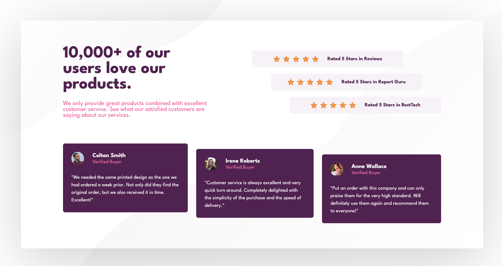

# Frontend Mentor - Social proof section solution

This is a solution to the [Social proof section challenge on Frontend Mentor](https://www.frontendmentor.io/challenges/social-proof-section-6e0qTv_bA). Frontend Mentor challenges help you improve your coding skills by building realistic projects. 

## Table of contents

- [Overview](#overview)
  - [The challenge](#the-challenge)
  - [Screenshot](#screenshot)
  - [Links](#links)
- [My process](#my-process)
  - [Built with](#built-with)
  - [What I learned](#what-i-learned)
  - [Continued development](#continued-development)
  - [Useful resources](#useful-resources)
- [Author](#author)

## Overview

### The challenge

Users should be able to:

- View the optimal layout for the section depending on their device's screen size

### Screenshot

### Links

- Live Site URL: [Live site URL](https://social-proof-312566.netlify.app/)

## My process

### Built with

- Semantic HTML5 markup
- CSS custom properties
- Flexbox
- CSS Grid
- Sass
- Mobile-first workflow

### What I learned

HTML structure, Css flexbox, Css Bem notation, Grid, Sass.

### Continued development

Keep practicing Front End skills, specially focus on Prepocesors, Javascript and React JS.

## Author

- Frontend Mentor - [@giovanigomez1](https://www.frontendmentor.io/profile/giovanigomez1)
- Twitter - [@yourusername](https://www.twitter.com/Giovani97753873)

